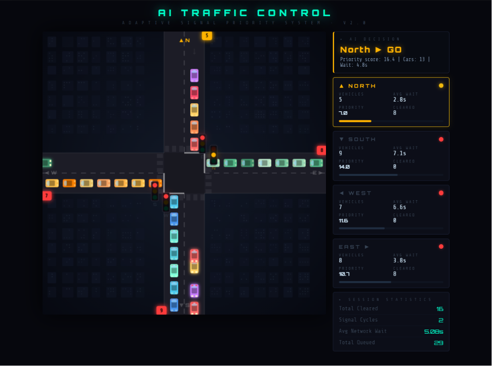

[README.md](https://github.com/user-attachments/files/29744000/README.md)
# 🚦 AI Traffic Signal Controller

A simulation of an intelligent traffic signal system that dynamically decides which road gets the green light based on live traffic conditions. Built two ways: a Python/Tkinter desktop version and a browser-based HTML/JS/Canvas dashboard.

🔗 **[Live Demo](https://ashiqhameed.github.io/ai-traffic-signal-controller/traffic_controller.html)** — try it directly in your browser, no setup required



## Overview

Traditional traffic signals cycle through fixed timers regardless of actual road conditions. This project simulates a smarter alternative: a controller that continuously evaluates traffic volume and wait times across four directions (North, South, East, West) and prioritizes the road that needs it most — while also handling emergency vehicle overrides.

Two implementations are included:
- **`traffic_controller.py`** — desktop simulation using Python and Tkinter
- **`traffic_controller.html`** — browser-based version using HTML5 Canvas and vanilla JavaScript, with a more polished real-time UI (animated cars, glowing signal states, live priority scores)

## Features

- **Heuristic-based decision engine** — scores each road using a weighted combination of traffic volume and average wait time, then selects the highest-priority road for green light
- **Emergency vehicle override** — randomly simulated emergency events immediately preempt normal signal logic
- **Realistic traffic flow simulation** — cars clear gradually during green phases rather than instantly, and non-green roads accumulate wait time
- **Live animated dashboard** — real-time Tkinter GUI showing signal states, car counts, and average wait per road
- **Session statistics** — tracks total vehicles cleared, signal cycles, and running average wait time

## How It Works

1. Every 5 seconds, the simulation adds new incoming traffic to each road at random.
2. A priority score is calculated for each road: `traffic_volume + (waiting_time * 0.7)`.
3. The road with the highest score gets the green light (unless an emergency override fires).
4. The signal transitions through yellow → red → green with realistic delays.
5. While green, vehicles are cleared gradually (1–3 per second) rather than all at once.
6. The dashboard updates live with car counts, wait times, and overall stats.

## Tech Stack

- **Python 3** with **Tkinter** (desktop version)
- **HTML5 Canvas** and **vanilla JavaScript** (browser version)

## Running It

**Browser version (recommended):**
Open `traffic_controller.html` directly in any browser, or [try the live demo](https://ashiqhameed.github.io/ai-traffic-signal-controller/traffic_controller.html).

**Python version:**
```bash
python traffic_controller.py
```
No external dependencies — just Python 3 with Tkinter (included in most standard installations).

## Possible Extensions

- Replace the heuristic scoring with a reinforcement learning agent that learns optimal signal timing from simulated traffic patterns
- Add multi-intersection coordination (a network of signals communicating with each other)
- Log historical data to compare heuristic vs. learned policies

## Author

Ashiq Hameed — B.Tech Artificial Intelligence & Data Science
