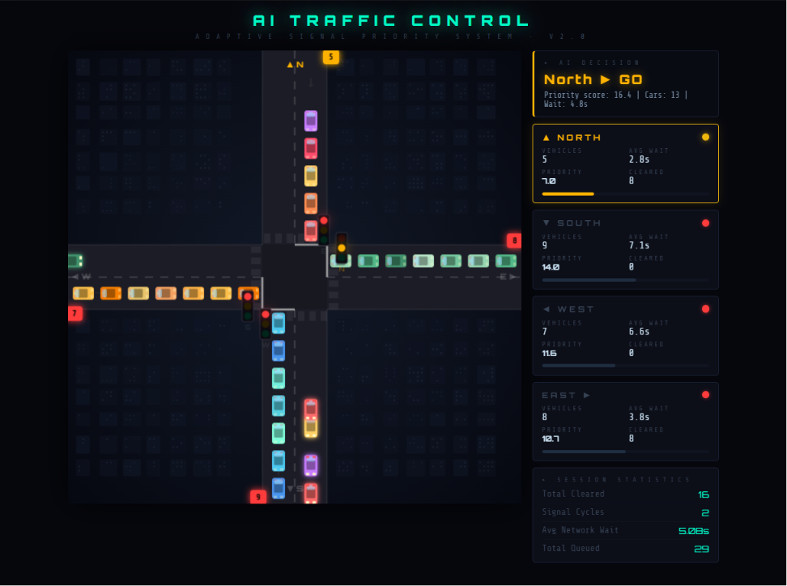
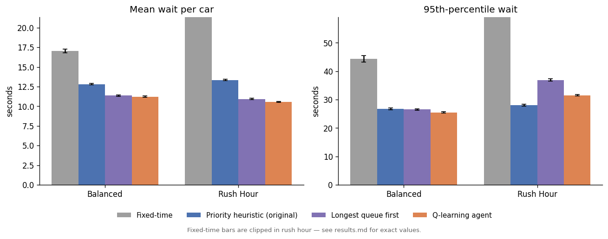

# 🚦 Adaptive Traffic Signal Controller

A simulation of an adaptive traffic signal system that dynamically decides which road gets the green light based on live traffic conditions, using a weighted priority heuristic. Built two ways: a Python/Tkinter desktop version and a browser-based HTML/JS/Canvas dashboard.

🔗 **[Live Demo](https://ashiqhameed.github.io/ai-traffic-signal-controller/traffic_controller.html)** — try it directly in your browser, no setup required



## Overview

Traditional traffic signals cycle through fixed timers regardless of actual road conditions. This project simulates an adaptive alternative: a controller that continuously evaluates traffic volume and wait times across four directions (North, South, East, West) and prioritizes the road that needs it most — while also handling emergency vehicle overrides.

Two implementations are included:
- **`traffic_controller.py`** — desktop simulation using Python and Tkinter
- **`traffic_controller.html`** — browser-based version using HTML5 Canvas and vanilla JavaScript, with a more polished real-time UI (animated cars, glowing signal states, live priority scores)

## Features

- **Heuristic priority engine** — scores each road using a weighted combination of traffic volume and average wait time, then selects the highest-priority road for green light
- **Emergency vehicle override** — randomly simulated emergency events immediately preempt normal signal logic
- **Realistic traffic flow simulation** — cars clear gradually during green phases rather than instantly, and non-green roads accumulate wait time
- **Live animated dashboard** — real-time Tkinter GUI showing signal states, car counts, and average wait per road
- **Session statistics** — tracks total vehicles cleared, signal cycles, and running average wait time

## How It Works

1. Every 5 seconds, the simulation adds new incoming traffic to each road at random.
2. A priority score is calculated for each road: `traffic_volume + (waiting_time * 0.7)`.
3. The road with the highest score gets the green light (unless an emergency override fires).
4. The signal transitions through yellow → red → green with realistic delays.
5. While green, vehicles are cleared gradually (1–3 per second) rather than all at once.
6. The dashboard updates live with car counts, wait times, and overall stats.

> **Note on naming:** the repo URL keeps its original name (`ai-traffic-signal-controller`) so existing links and the live demo keep working. The controller itself is a rule-based heuristic, not a learned model.

## Tech Stack

- **Python 3** with **Tkinter** (desktop version)
- **HTML5 Canvas** and **vanilla JavaScript** (browser version)

## Running It

**Browser version (recommended):**
Open `traffic_controller.html` directly in any browser, or [try the live demo](https://ashiqhameed.github.io/ai-traffic-signal-controller/traffic_controller.html).

**Python version:**
```bash
python traffic_controller.py
```
No external dependencies — just Python 3 with Tkinter (included in most standard installations).

## Reinforcement Learning Agent

The [`rl/`](rl/) folder trains a **Q-learning agent** to control the same intersection and compares it against the original heuristic on identical, unseen traffic.



| Mean wait per car | Balanced traffic | Rush hour (N–S heavy) |
|---|---|---|
| Fixed-time signal | 17.0 s | 98.2 s |
| Priority heuristic (original) | 12.8 s | 13.4 s |
| Longest queue first | 11.4 s | 10.9 s |
| **Q-learning agent** | **11.2 s** (−12%) | **10.6 s** (−21%) |

*300 test episodes per policy (~17 simulated minutes each), on traffic seeds never used in training. Full results with 95% confidence intervals and 95th-percentile waits: [`rl/results/results.md`](rl/results/results.md).*

**Setup**
- **Simulator** ([`traffic_env.py`](rl/traffic_env.py)): a discrete-time version of the demo — same arrival rates, 10% emergency overrides, 1–3 cars cleared per green second. One realistic addition: switching the green road costs 1 second of yellow/all-red time, while holding it doesn't.
- **Reward:** negative vehicle-seconds of queueing each cycle, so maximising reward minimises average delay.
- **Agent** ([`policies.py`](rl/policies.py)): linear Q-learning. Each road is scored from its queue length, how long its front car has waited, whether it's already green, and overall congestion, with one shared set of learned weights.
- **Fair comparison:** every policy faces exactly the same arrivals, emergencies and discharge rates per test seed.

**Findings**
- The agent has the **lowest average wait in both scenarios**, beating the original heuristic by 12–21%. In balanced traffic its edge over plain *longest-queue-first* is small (~1%).
- Its learned weights show it **prefers holding the current green when that road still has cars**, avoiding the lost switching time. Nobody programmed that; it learned it from the reward.
- **Trade-off:** in rush hour, the slowest 5% of cars wait longer under the agent (31.5 s) than under the original heuristic (28.1 s), whose waiting-time term protects the quiet roads. It's still far better than longest-queue-first (36.9 s).

**What didn't work (and why)**
- A **lookup-table Q-learner** came first. It had to bucket queue lengths (e.g. "6–9 cars"), which erased exactly the comparisons that decide which road should go green. Even after 20,000 training episodes it was worse than the simple rules (13.9 s in balanced traffic).
- The first linear agent **diverged** in rush hour at learning rate 0.01, with weights blowing up to ±20. Lowering it to 0.003 made training stable in both scenarios.

**Run it**
```bash
pip install -r rl/requirements.txt
python rl/train.py      # ~1 minute per scenario
python rl/evaluate.py   # writes rl/results/
python -m pytest rl     # simulator sanity tests
```

## Possible Extensions

- Add a fairness term to the reward (e.g. penalise the longest-waiting car) to close the rush-hour tail-latency gap
- Swap the linear agent for a small neural network (DQN) and test on more varied traffic patterns
- Add multi-intersection coordination (a network of signals communicating with each other)
- Run the trained agent live in the browser demo alongside the heuristic

## Author

Ashiq Hameed — B.Tech Artificial Intelligence & Data Science
